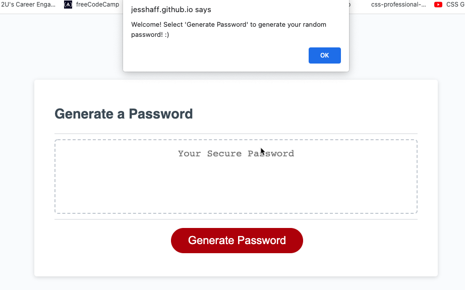
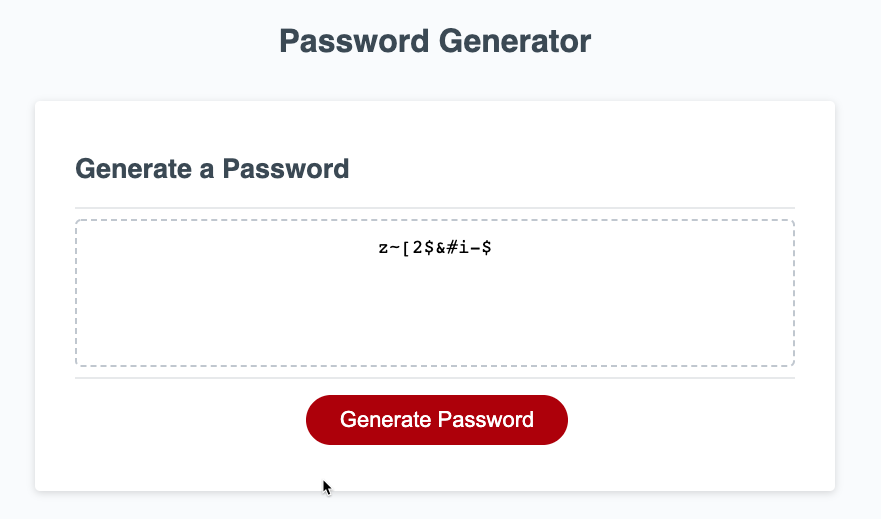

# javascript-password-generator-3

## 03 JavaScript: Password Generator
<br>

### Description: 
#### This homework is a random password generator website which was completed by Jessica Haff. The purpose of this homework was to write JavaScript code to make a random password generate for the user based off the criteria chosen in the prompts.
<br>
<br>

### Acceptance Criteria
```
GIVEN I need a new, secure password
WHEN I click the button to generate a password
THEN I am presented with a series of prompts for password criteria
WHEN prompted for password criteria
THEN I select which criteria to include in the password
WHEN prompted for the length of the password
THEN I choose a length of at least 8 characters and no more than 128 characters
WHEN asked for character types to include in the password
THEN I confirm whether or not to include lowercase, uppercase, numeric, and/or special characters
WHEN I answer each prompt
THEN my input should be validated and at least one character type should be selected
WHEN all prompts are answered
THEN a password is generated that matches the selected criteria
WHEN the password is generated
THEN the password is either displayed in an alert or written to the page
```
<br>
<br>

### Tasks Completed
```
- JavaScript: Added variables for the password criteria
- JavaScript: Added a welcome prompt to page
- JavaScript: Added prompts for the user to select their password criteria
- JavaScript: Added a random generator to return final password based off of the users selected criteria
-- JavaScript: Added descriptive comments to the script.js file

- Added screenshot of updated webpage to images folder showing prompts and end result
```

### Links
[Link to Live Webpage](https://jesshaff.github.io/javascript-password-generator-3/)

[Link to Github Repository](https://github.com/jesshaff/javascript-password-generator-3)

### Screenshots
## -Prior to Changes-


<br>

## -After Changes-
### Welcome Prompt at Page Load

### Final Result - Random Password Generated
